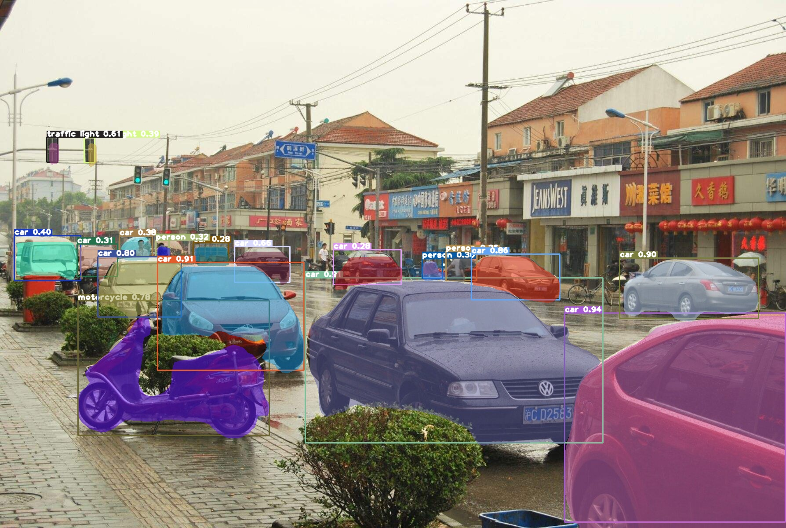

# TensorRT deploy YOLOv8 segment



## Get onnx

```bash
pip install ultralytics
pip install onnx==1.12.0
pip install onnxsim==0.4.33
```

write export_onnx.py, as follow:

```python
from ultralytics import YOLO

model = YOLO("./weights/yolov8s-seg.pt")
path = model.export(format="onnx", simplify=True, device=0, opset=12, dynamic=False, imgsz=640)
```

run export_onnx.py

```bash
python export_onnx.py
```

`yolov8s-seg.onnx` will be generated

## To TensorRT

1. Switch to the current project directory;
2. Confirm `cuda` and `tensorrt` path in  `CMakeLists.txt`
3. Create `onnx_model` directory and put the exported `onnx` model in

4. Run as follow:

```bash
mkdir build
cd build
cmake ..
make
./main ../images
```