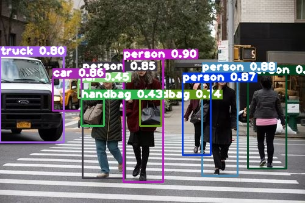

# TensorRT 部署 YOLOv8 目标检测、关键点检测、实例分割

## 一. 项目简介

- 基于 `TensorRT-v8` ，部署`YOLOv8` 目标检测、关键点检测、实例分割、目标跟踪；
- 支持嵌入式设备 `Jetson` 系列上部署，也可以在 `Linux x86_64` 的服务器上部署；

- 本项目无需编译安装支持`cuda`的`OpenCV`，前后处理相关的张量操作都是作者通过`cuda`编程实现；
- 模型转换方式：`.pth` -> `.onnx` -> `.plan(.engine)`；
- 作者使用 `Python` 和 `C++` 2 种 `api` 分别做了实现；
- 均采用了面向对象的方式，便于结合到其他项目当中；
- `C++` 版本的还会编译为动态链接库，便于在其他项目种作为接口调用；

## 二. 项目效果

|               原图                |               目标检测                |
| :-------------------------------: | :-----------------------------------: |
|            |  |
|          **关键点检测**           |             **实例分割**              |
|  |        |

- ByteTrack目标跟踪

## 三. 推理速度

|        | detect | pose  | segment |
| :----: | :----: | :---: | :-----: |
|  C++   |  4 ms  | 5 ms  |  8 ms   |
| python | 15 ms  | 15 ms |  58 ms  |

- 这里的推理时间包含前处理、模型推理、后处理
- 这里基于 `x86_64 Linux ` 服务器，`Ubuntu`系统，显卡为`GeForce RTX 2080 Ti`

## 四. 环境配置

1. 基本要求：

- `TensorRT 8.0+`
- `OpenCV 3.4.0+`

**如果基本要求已满足，可直接进入各目录下运行各任务**

**环境构建可以参考下面内容：**

2. 如果是 `Linux x86_64` 服务器上，建议使用 `docker`

- 具体环境构建，可参考这个链接 [构建TensorRT环境](https://github.com/emptysoal/tensorrt-experiment) 的环境构建部分，也是作者的项目

3. 如果是边缘设备，如：`Jetson Nano`

- 烧录 `Jetpack 4.6.1 ` 系统镜像，网上烧录镜像资料还是很多的，这里就不赘述了
- `Jetpack 4.6.1 ` 系统镜像原装环境如下：

| CUDA | cuDNN | TensorRT | OpenCV |
| ---- | ----- | -------- | ------ |
| 10.2 | 8.2   | 8.2.1    | 4.1.1  |

## 五. 项目运行

- 本项目`Python`和`C++`目录下均包含`detect`、`pose` 和 `segment`；
- 按照各自目录下的 `README` 分别实现目标检测、关键点检测、实例分割 3 种任务。

- [C++ api detect](https://github.com/emptysoal/TensorRT-YOLOv8/tree/main/C%2B%2B/detect)
- [C++ api pose](https://github.com/emptysoal/TensorRT-YOLOv8/tree/main/C%2B%2B/pose)
- [C++ api segment](https://github.com/emptysoal/TensorRT-YOLOv8/tree/main/C%2B%2B/segment)
- [Python api detect](https://github.com/emptysoal/TensorRT-YOLOv8/tree/main/python/detect)
- [Python api pose](https://github.com/emptysoal/TensorRT-YOLOv8/tree/main/python/pose)
- [Python api segment](https://github.com/emptysoal/TensorRT-YOLOv8/tree/main/python/segment)

- [C++ api track](https://github.com/emptysoal/TensorRT-YOLOv8/tree/main/C%2B%2B/)

- [Python api track](https://github.com/emptysoal/TensorRT-YOLOv8/tree/main/python)
