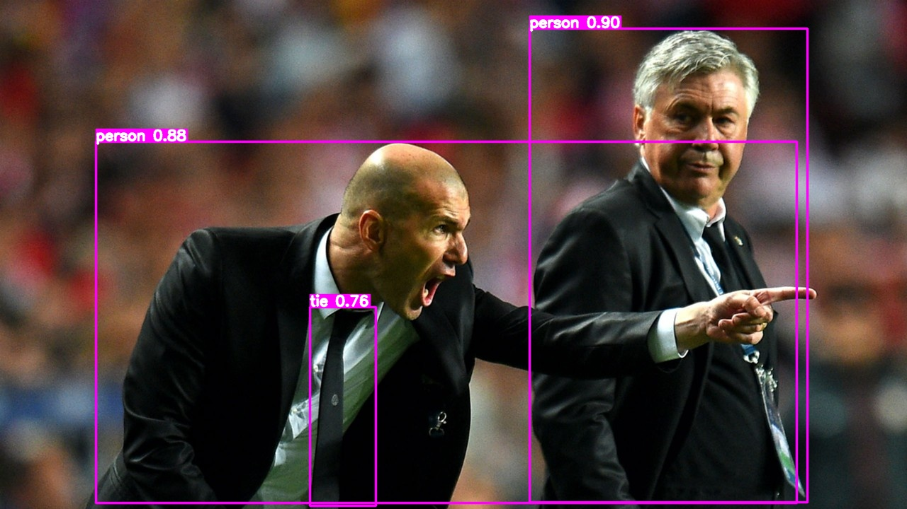

# YOLOv8 目标检测模型转 TensorRT



## 导出ONNX模型

1. 安装 `YOLOv8`

```bash
pip install ultralytics
```

- 建议同时从 `GitHub` 上 clone 或下载一份 `YOLOv8` 源码到本地；
- 根据 `GitHub` 上 `YOLOv8` 的 `README` 中的链接下载检测模型，如：`yolov8s.pt`；
- 在本地 `YOLOv8`一级 `ultralytics` 目录下，新建 `weights` 目录，并且放入下载的`yolov8s.pt`模型

2. 安装onnx相关库

```bash
pip install onnx==1.12.0
pip install onnxsim==0.4.33
```

3. 导出onnx模型

- 可以在一级 `ultralytics` 目录下，新建 `export_onnx.py` 文件
- 向文件中写入如下内容：

```python
from ultralytics import YOLO

model = YOLO("./weights/yolov8s.pt", task="detect")
path = model.export(format="onnx", simplify=True, device=0, opset=12, dynamic=False, imgsz=640)
```

- 运行 `python export_onnx.py` 后，会在 `weights` 目录下生成 `yolov8s.onnx`

## 转 TensorRT

### 环境要求

1. Python库基本要求如下，大版本满足即可：

```bash
tensorrt==8.2.4.2
cuda-python==12.1.0
opencv-python==4.9.0.80
```

**如果基本要求已满足，可直接到后面的模型转换部分**

2. 如果是 `Linux x86_64` 服务器上，建议使用 `docker`

- 具体环境构建，可参考这个链接 [构建TensorRT环境](https://github.com/emptysoal/tensorrt-experiment) 的环境构建部分

3. 如果是边缘设备，如：`Jetson Nano`

- 烧录 `Jetpack 4.6.1 ` 系统镜像，网上烧录镜像资料还是很多的，这里就不赘述了
-  `Jetpack 4.6.1 ` 系统镜像原装环境如下：

| CUDA | cuDNN | TensorRT | OpenCV |
| ---- | ----- | -------- | ------ |
| 10.2 | 8.2   | 8.2.1    | 4.1.1  |

- 安装必要的 python 库

```bash
pip install cuda-python
```

### 模型转换

1. 切换到当前项目目录下；
2. 如果是自己数据集上训练得到的模型，记得更改 `config.py` 中的相关配置；
3. 新建 `onnx_model`目录，并将已导出的 `onnx` 模型拷贝到 `onnx_model` 目录下；
4. 执行以下命令：

```bash
python main.py  # 不存在trt模型时，会先构建trt模型然后推理；存在trt模型时，直接加载trt模型然后推理
```

之后转换后的模型，以及首次 TensorRT 的推理结果都会保存到当前目录下

